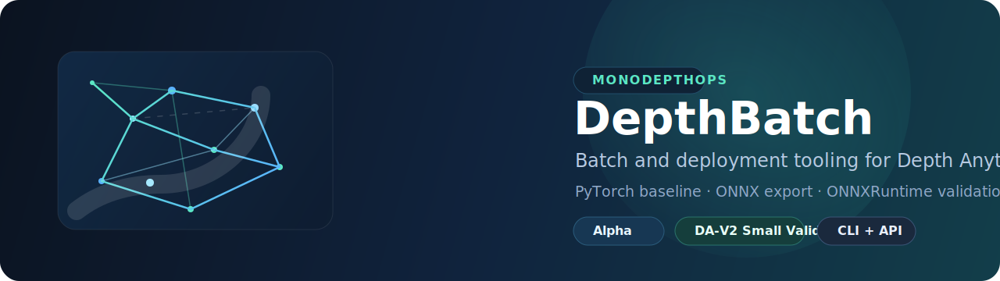

<p align="center">
  
</p>

<p align="center">
  <a href="README.md">English</a> · <strong>简体中文</strong>
</p>

<p align="center">
  <a href="https://github.com/SakuraTearDuDu/DepthBatch/actions/workflows/ci.yml">
    
  </a>
  <a href="https://github.com/SakuraTearDuDu/DepthBatch/releases/tag/v0.1.0-alpha">
    
  </a>
  
  
</p>

<p align="center">
  <a href="docs/quickstart.md">Quick Start (EN)</a> ·
  <a href="docs/quickstart.zh-CN.md">快速开始 (ZH-CN)</a> ·
  <a href="docs/license_notes.md">许可边界</a> ·
  <a href="docs/deployment_notes.md">部署说明</a> ·
  <a href="https://github.com/SakuraTearDuDu/DepthBatch/releases/tag/v0.1.0-alpha">v0.1.0-alpha</a>
</p>

# DepthBatch

DepthBatch 是一个围绕 [Depth Anything V2](https://github.com/DepthAnything/Depth-Anything-V2) 推理语义构建的、面向单目深度估计批处理与部署验证的工程工具链。

它不是训练框架、模型大全仓库，也不是 GUI 产品。这个项目的重点，是把上游以单图和单视频为主的推理流程，整理成更适合工程复用的工具包，提供一致的 CLI、Python API、manifest、ONNX 导出入口和结构化运行产物。

> 当前发布范围：`v0.1.0-alpha` 已记录 DA-V2 Small 在当前环境上的本地证据：canonical PyTorch 路径已覆盖 CPU 与 CUDA，静态方形 ONNXRuntime 路径已覆盖 CPU 与当前 Windows/NVIDIA CUDA 环境；`fake` 仍然是 CI 与 smoke test 的安全默认入口。

## 项目为什么存在

Depth Anything V2 上游仓库已经很好地定义了模型行为、预处理方式和基础推理用法。DepthBatch 在这个基线上进一步做工具层封装，主要解决这类工程问题：

- 面向单张图、文件夹和 `.txt` 清单的批处理推理
- 输出工件的统一管理
- ONNX 导出与部署验证
- 基准测试与运行结果检查
- 更适合 GitHub 开源分发的打包与 CI
- 更贴近 Windows 和普通 Python 用户的命令行使用方式

## 项目定位

DepthBatch 有意把上游原生 PyTorch 路线保留为语义上的 canonical baseline。

- `pytorch`：主真实路径；当前已在 DA-V2 Small + 本地权重场景下完成本地验证
- `onnxruntime`：部署验证路径；当前已验证的是静态方形 ONNX 导出路径，并记录了当前 Windows/NVIDIA 环境下的 CUDAExecutionProvider 证据
- `transformers`：实验性兼容路径
- `fake`：用于 CI、示例和 smoke test 的确定性测试后端

TensorRT 目前只作为未来扩展点保留，不属于 V1 已实现能力。

## 安装

### 基础安装

```powershell
python -m venv .venv
.venv\Scripts\Activate.ps1
python -m pip install --upgrade pip
pip install -e .
```

### 开发依赖

```powershell
pip install -e .[dev]
```

### 真实后端附加依赖

```powershell
pip install -e .[pytorch]
pip install -e .[pytorch,onnx]
pip install -e .[transformers]
```

> GPU 相关 wheel 仍然是环境相关选择，因此没有被硬编码进 `pyproject.toml`。当前仓库记录的 Windows 11 + RTX 4080 SUPER 安装命令见 [docs/deployment_notes.md](docs/deployment_notes.md)。

## 快速开始

建议先走 smoke path，再进入 real backend。

中文快速开始见 [docs/quickstart.zh-CN.md](docs/quickstart.zh-CN.md)。如果你还需要对照英文版命令说明，可再查看 [docs/quickstart.md](docs/quickstart.md)。

### 1. 先用 fake backend 做 smoke test

```powershell
depthbatch infer-images `
  --backend fake `
  --input tests/fixtures/images `
  --output runs/fake-smoke `
  --save-raw `
  --stdout-json
```

### 2. 下载官方 DA-V2 Small 权重到仓库内

```powershell
python scripts/download_da_v2_small.py
```

默认目标路径是 `artifacts/weights/depth_anything_v2_vits.pth`。脚本会使用 `checksums/depth_anything_v2_vits.sha256` 中记录的 SHA256 做校验。

当前 alpha 版本还在 GitHub pre-release 页面额外提供了同一份官方 Small checkpoint 的下载入口： [DepthBatch `v0.1.0-alpha` Release](https://github.com/SakuraTearDuDu/DepthBatch/releases/tag/v0.1.0-alpha)。不过仓库源码历史中仍然不捆绑该权重文件。

### 3. 运行真实 PyTorch 推理

```powershell
depthbatch infer-images `
  --backend pytorch `
  --model da-v2-small `
  --weights artifacts\weights\depth_anything_v2_vits.pth `
  --input tests\fixtures\images `
  --output runs\real-small-pytorch `
  --save-raw `
  --stdout-json
```

在当前记录的 Windows/NVIDIA 环境中，这条路径还额外用 `--device cuda` 完成了本地实测。

### 4. 导出 ONNX

```powershell
pip install -e .[pytorch,onnx]

depthbatch export-onnx `
  --backend pytorch `
  --model da-v2-small `
  --weights artifacts\weights\depth_anything_v2_vits.pth `
  --output artifacts\onnx `
  --stdout-json
```

### 5. 用 ONNXRuntime 做部署验证

DepthBatch `0.1.0a0` 当前对 ONNXRuntime 的已验证路径，是静态方形导出（`input_size=518`，并在导出元数据中记录 `keep_aspect_ratio=false`）。这表示“工程上的部署验证路径已经打通”，不代表它与 canonical PyTorch 预处理路径在数值上完全等价。

```powershell
depthbatch infer-onnx `
  --model da-v2-small `
  --onnx-path artifacts\onnx\artifacts\export\model.onnx `
  --input tests/fixtures/images `
  --output runs\real-small-onnx `
  --save-raw `
  --stdout-json
```

当前记录的本地 GPU 验证也已通过 `--device cuda` 路径，实际 provider 为 `CUDAExecutionProvider`，并保留 CPU fallback。

### 6. 跑一个最小 benchmark

```powershell
depthbatch benchmark `
  --model da-v2-small `
  --weights artifacts\weights\depth_anything_v2_vits.pth `
  --onnx-path artifacts\onnx\artifacts\export\model.onnx `
  --device cuda `
  --input tests\fixtures\images `
  --output runs\real-small-benchmark `
  --stdout-json
```

当 `benchmark` 同时比较 `pytorch` 和 `onnxruntime` 时，当前实现还会把统计一致性信息写进 `reports/benchmark.json` 和 `reports/benchmark.md`。这些归一化误差指标用于工程判断，不应解读为“数值完全等价保证”。

## CLI

```text
depthbatch infer-images ...
depthbatch infer-video ...
depthbatch export-onnx ...
depthbatch infer-onnx ...
depthbatch benchmark ...
depthbatch inspect ...
```

通用约定：

- `--input` 支持单文件、目录或 `.txt` 路径清单
- `--config` 支持 YAML 或 JSON 配置文件
- `--set key=value` 可覆盖配置项
- `--output` 指向单次运行的根目录
- `--stdout-json` 输出紧凑的运行摘要

## Python API

```python
from pathlib import Path

from depthbatch.api import infer_images

result = infer_images(
    backend_name="fake",
    input_path=Path("tests/fixtures/images"),
    output_root=Path("runs/api-smoke"),
    save_raw=True,
)

print(result.manifest_path)
```

## 输入与输出

支持的输入类型：

- 单张图像
- 图像目录
- 包含图像路径的 `.txt` 文件
- 单个视频
- 视频目录
- 包含视频路径的 `.txt` 文件

单次运行的标准输出结构：

- `manifest.json`
- `items.jsonl`
- `resolved-config.yaml`
- `environment.json`
- `artifacts/depth/`
- `artifacts/raw/`
- `artifacts/preview/`
- `artifacts/video/`
- `artifacts/export/`
- `reports/`

## 后端说明

| 后端 | 当前状态 | 说明 |
| --- | --- | --- |
| `fake` | verified | 用于 CI 和 smoke test 的确定性测试后端 |
| `pytorch` | alpha-supported | 已在 Windows 11 / Python 3.12.7 / `torch 2.11.0+cu128` 下，对 DA-V2 Small + 本地权重路径完成 CPU 与 CUDA 本地验证 |
| `onnxruntime` | alpha-supported | 已在 Windows 11 / Python 3.12.7 / `onnxruntime-gpu 1.25.0` 下验证静态方形导出路径，并记录 CPU smoke 与 CUDAExecutionProvider 证据 |
| `transformers` | experimental | 实验性兼容路径，不是 canonical baseline |

这里的“已验证”指当前 alpha 版本已有明确的本地验证记录，不应误解为跨平台、跨环境、跨模型规模的全面稳定支持。

## 当前限制

- 仓库不捆绑模型权重，也不捆绑导出的 ONNX 文件
- 不包含训练、微调、蒸馏或 metric depth 研究流程
- V1 不包含 TensorRT 后端实现
- 当前 GPU 证据只覆盖已记录的 Windows 11 + RTX 4080 SUPER 环境
- Dynamic ONNX export 还不是 `v0.1.0-alpha` 的已验证发布路径
- 当前 ONNXRuntime 验证基于静态方形预处理契约
- benchmark 中的统计一致性信息不是“数值完全等价”承诺
- `export-onnx` 的最小 smoke 仍保持 CPU 路径，以便让发布检查更稳定
- 真实后端的可用性仍依赖用户本地环境与用户提供的工件

## 许可证说明

仓库代码本身采用 Apache-2.0。来自 Depth Anything V2 和 DINOv2 的 vendored runtime 代码归属和致谢保留在 `NOTICE` 中。

需要特别注意：模型权重的许可与仓库代码许可不是一回事。当前默认、且已验证的公开路径是“Depth Anything V2 Small + 用户自备本地权重”。在使用非 Small checkpoint，或再分发权重、ONNX、TensorRT engine 等衍生产物之前，请先阅读 [docs/license_notes.md](docs/license_notes.md)。

不要把这理解成“整个项目及其相关模型文件都自动等同于 Apache-2.0”。

## 路线图

- 将验证范围扩展到 DA-V2 Small 之外，以及当前记录环境之外
- 补充更丰富的 ONNX benchmark 预设
- 补齐 TensorRT 后端契约实现
- 改进多次运行的对比报告能力
